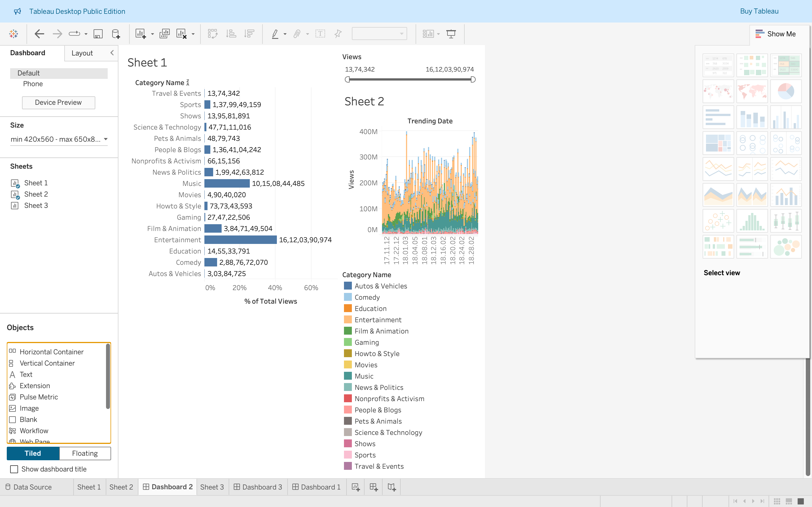
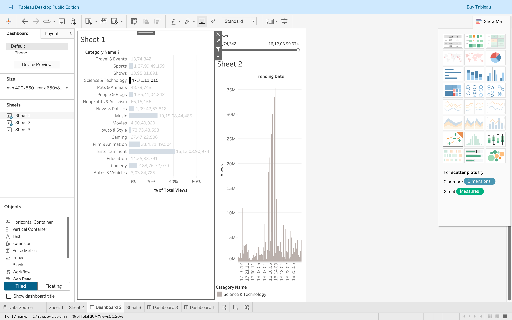

# 📈 YouTube Trending Analysis





This project analyzes YouTube trending video data using **Python** for preprocessing and **Tableau** for visualization.  
The dashboard explores video categories, views over time, and engagement metrics.

---

## 🔧 Setup Instructions

### Install Python dependencies

```bash
pip install -r requirements.txt
```

### Open Tableau Dashboard

- Navigate to `tableau/Book1.twb`
- Open it in Tableau Desktop or Tableau Public

---

## 📁 Project Structure

```
youtube-trending-analysis/
├── analysis/                   # Python scripts and notebooks
├── data/                       # Raw or cleaned datasets
├── tableau/
│   └── Book1.twb               # Tableau dashboard
├── README.md                   # Project overview
└── requirements.txt            # Python dependencies
```

---

## 🚀 How to Use

### Python
- Run the scripts inside `analysis/` to explore or clean the data.
- Generate visualizations using `matplotlib`, `seaborn`, or similar libraries.

### Tableau
- Open `Book1.twb` in Tableau.
- Explore views by date, filter by video category, and interact with charts using "Use as Filter".

---

## 📊 Dashboard Features

- Views by Video Category
- Daily trends of views and uploads
- Calculated field to map Category IDs to readable names
- Interactive filters with dashboard syncing  
📍 Located at `tableau/Book1.twb`

---

## 🔍 Insights

- 🎵 **Music**, 🎭 **Entertainment**, and 😂 **Comedy** dominate trending content.
- ⏰ Viewership spikes during specific times and days.
- 💬 High views don’t always mean high engagement — the engagement rate varies by category.

---

## 🧰 Tech Stack

- **Python** (Pandas, Seaborn, Matplotlib)
- **Tableau** (Desktop or Public)
- **Git + GitHub**

---

## 👩‍💻 Author

**Ayushi Sharma**  
🔗 [GitHub](https://github.com/ayushiszn3)

---

## 📜 License

This project is licensed under the **MIT License**.  
Feel free to fork, use, and improve upon it!